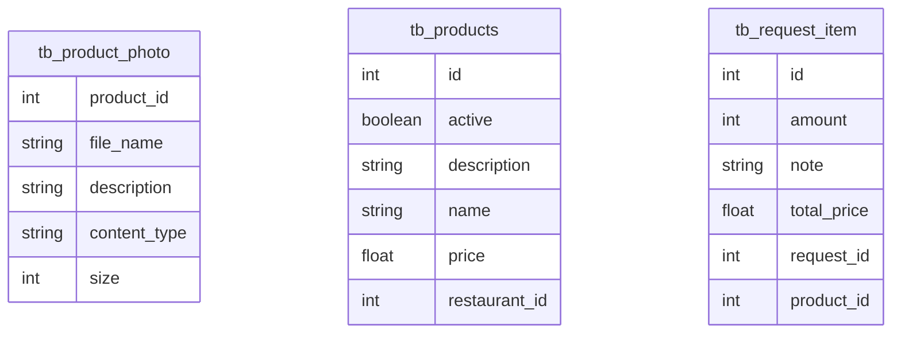

```mermaid
erDiagram

    tb_product_photo {
        int product_id
        string file_name
        string description
        string content_type
        int size
    }

    tb_products {
        int id
        boolean active
        string description
        string name
        float price
        int restaurant_id
    }

    tb_request_item {
        int id
        int amount
        string note
        float total_price
        int request_id
        int product_id
    }

```
